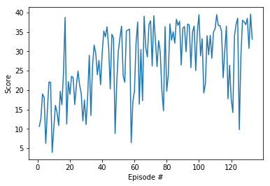

# Double Jointed Arm Project Report

## Learning Algorithim

For this project, I modified the [Deep Determanistic Policy Gradient (DDPG) implementation](https://github.com/udacity/deep-reinforcement-learning/blob/master/ddpg-bipedal/ddpg_agent.py) provided in the course to solve the environment. For both the actor and critic networks I used fully connected networks with 2 hidden 128 node layers each.
For training, I used an Adam Optimizer with a learning rate of 2e-4 for both networks. Additionally, I ran two learning steps for every step taken in the environment after the replay buffer had sufficent experience tuples. I was inspired to try this after reading about the reference implementation with 20 parallel agents 

## Plot of Rewards during training

### Training of DDPG-based agent, 33 episodes were need to learn acceptable level of performance (agent was run for 133 episodes all altogether)

## Further Improvement

To further improve the performace of the network, a number of steps can be taken including:
* Training longer
* Increasing the size of the fully connected layers
* Adding more fully connected layers
* Train using parallel agents
* Use [A3C](https://arxiv.org/pdf/1602.01783.pdf) or [D4PG](https://openreview.net/pdf?id=SyZipzbCb) with parallel agents
